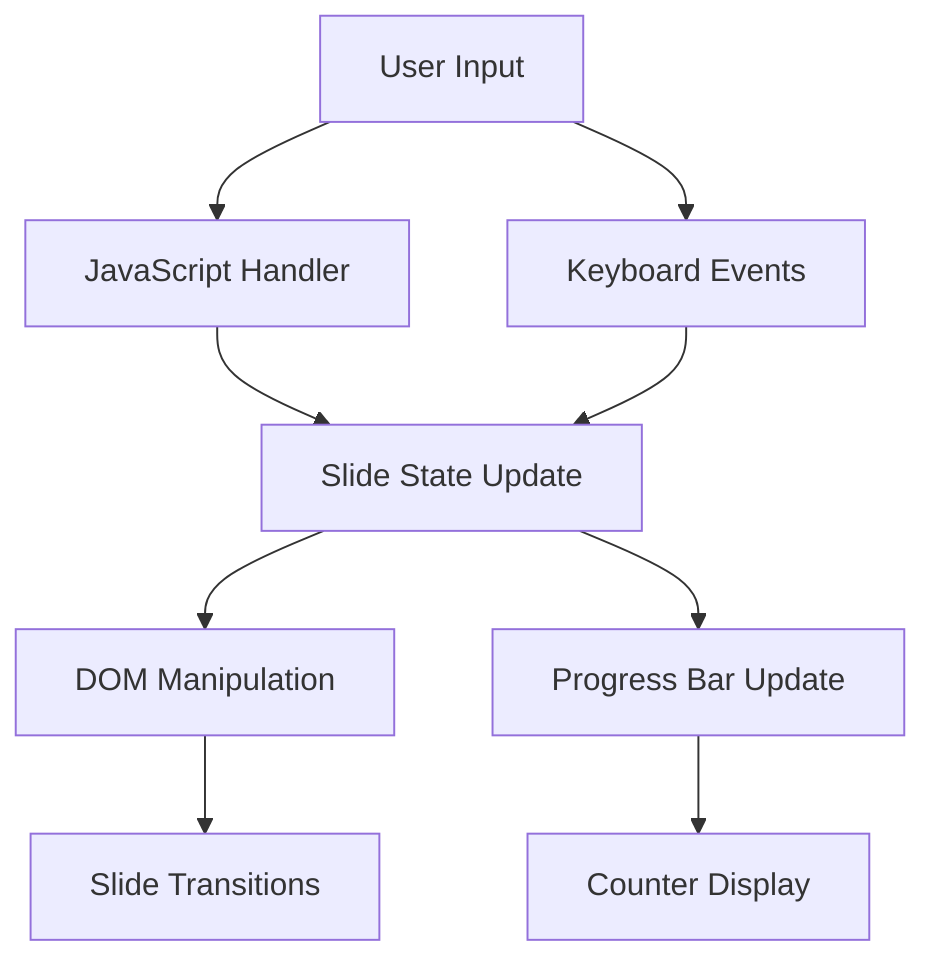
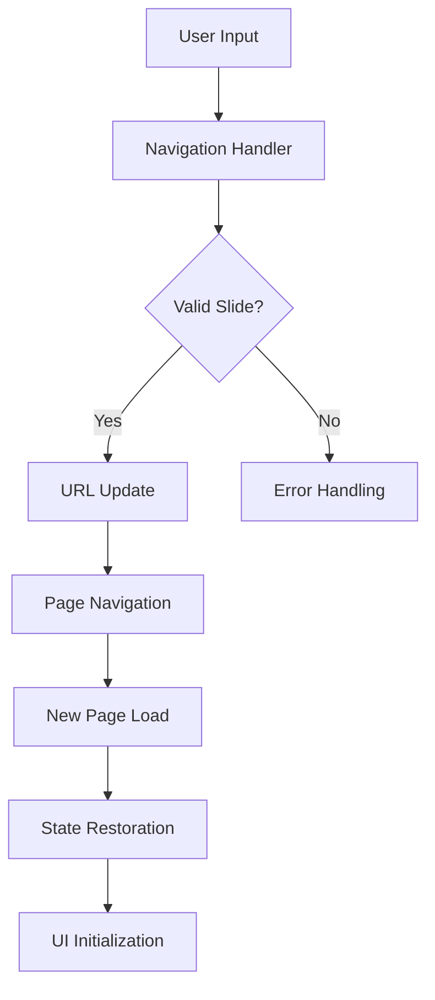

# EECOL Wire Tools Presentation - System Patterns

## System Architecture

### Current Architecture (Single-Page)
```
┌─────────────────┐    ┌──────────────────┐    ┌─────────────────┐
│   Hero Page     │───▶│ Single-Page      │───▶│  Iframe Demos   │
│   (index.html)  │    │ Presentation      │    │  (Limited)      │
└─────────────────┘    └──────────────────┘    └─────────────────┘
         │                       │                       │
         ▼                       ▼                       ▼
┌─────────────────┐    ┌──────────────────┐    ┌─────────────────┐
│  Navigation     │    │   Inline Styles  │    │   Tool Pages     │
│   (JavaScript)  │    │   (Embedded)     │    │   (src/pages/)   │
└─────────────────┘    └──────────────────┘    └─────────────────┘
```

### Target Architecture (Multi-Page)
```
┌─────────────────┐    ┌──────────────────┐    ┌─────────────────┐
│   Hero Page     │───▶│  Slide Pages     │───▶│ Direct Tool      │
│   (index.html)  │    │  (1-19 pages)    │    │ Integration      │
└─────────────────┘    └──────────────────┘    └─────────────────┘
         │                       │                       │
         ▼                       ▼                       ▼
┌─────────────────┐    ┌──────────────────┐    ┌─────────────────┐
│ Cross-Page Nav  │    │ Shared CSS/JS    │    │ Adapted Tools    │
│ (URL-based)     │    │ (CDN + Local)    │    │ (Demo Mode)      │
└─────────────────┘    └──────────────────┘    └─────────────────┘
```

### Component Relationships

#### Current Navigation System


#### Target Navigation System


## Key Technical Decisions

### 1. Single-Page to Multi-Page Transition

**Decision**: Move from working single-page to multi-page architecture
**Rationale**:
- **Performance**: Individual pages load faster, better caching
- **SEO**: Each slide has unique URL for bookmarking/sharing
- **Tool Integration**: Direct component embedding vs iframe limitations
- **Scalability**: Better handling of large presentation content
- **User Experience**: More flexible navigation and interaction

**Implementation Strategy**:
```javascript
// Current: Single-page navigation
function nextSlide() {
    currentSlideIndex++;
    updateSlideDisplay();
}

// Target: Multi-page navigation
function nextSlide() {
    const nextSlideNumber = currentSlideIndex + 1;
    if (nextSlideNumber <= totalSlides) {
        window.location.href = `../${nextSlideNumber}/index.html`;
    }
}
```

### 2. Tool Integration Evolution

**Decision**: Replace iframe demos with direct component integration
**Rationale**:
- **Interactivity**: Full tool functionality without iframe restrictions
- **Performance**: No cross-origin overhead or loading delays
- **User Experience**: Seamless interaction within presentation context
- **Maintenance**: Easier updates and synchronization with main tools

**Implementation Strategy**:
```html
<!-- Current: Iframe approach -->
<iframe src="src/pages/wire-mark-calculator/wire-mark-calculator.html" class="demo-iframe"></iframe>

<!-- Target: Direct integration -->
<div id="wire-mark-calculator-demo" class="tool-demo-container">
    <!-- Tool component embedded directly -->
</div>
```

### 3. State Management Across Pages

**Decision**: URL-based state with localStorage persistence
**Rationale**:
- **Bookmarking**: Users can save and share specific slides
- **Browser Navigation**: Back/forward buttons work correctly
- **Session Persistence**: Progress maintained across page reloads
- **Cross-Device**: State can sync via localStorage

**Implementation Strategy**:
```javascript
class PresentationState {
    static saveProgress(slideNumber) {
        localStorage.setItem('presentation-progress', slideNumber);
        // Update URL for bookmarking
        history.replaceState({slide: slideNumber}, '', `?slide=${slideNumber}`);
    }

    static getProgress() {
        return parseInt(localStorage.getItem('presentation-progress')) || 1;
    }
}
```

### 4. Progressive Enhancement Strategy

**Decision**: Maintain single-page as fallback with multi-page as enhancement
**Rationale**:
- **Reliability**: Single-page version always works
- **Performance**: Users can choose based on device/capability
- **Development**: Easier testing and validation
- **Accessibility**: Ensures presentation works in all scenarios

**Implementation Strategy**:
```html
<!-- Hero page provides choice -->
<div class="presentation-options">
    <a href="wire-tools-presentation.html" class="option-button">
        🚀 Single-Page Experience (Fastest)
    </a>
    <a href="src/pages/slides/1/index.html" class="option-button">
        📖 Multi-Page Experience (Enhanced)
    </a>
</div>
```

## Design Patterns Used

### 1. Component Isolation Pattern
```javascript
// Tool components designed for reuse
class ToolDemo {
    constructor(containerId, options = {}) {
        this.container = document.getElementById(containerId);
        this.options = { demoMode: true, ...options };
        this.init();
    }

    init() {
        this.setupDOM();
        this.attachEventListeners();
        this.loadDemoData();
    }
}
```

### 2. Navigation State Pattern
```javascript
// Centralized navigation management
const NavigationManager = {
    currentSlide: 1,
    totalSlides: 19,

    navigateTo(slideNumber) {
        if (this.isValidSlide(slideNumber)) {
            this.updateProgress(slideNumber);
            this.performNavigation(slideNumber);
        }
    },

    isValidSlide(slideNumber) {
        return slideNumber >= 1 && slideNumber <= this.totalSlides;
    }
};
```

### 3. Progressive Loading Pattern
```javascript
// Load tools only when needed
function loadToolForSlide(slideNumber) {
    const toolMap = {
        5: 'wire-mark-calculator',
        7: 'stop-mark-calculator',
        9: 'reel-size-estimator',
        11: 'cutting-records'
    };

    const toolName = toolMap[slideNumber];
    if (toolName) {
        import(`./tools/${toolName}-demo.js`)
            .then(module => module.initializeDemo())
            .catch(error => console.warn('Tool loading failed:', error));
    }
}
```

### 4. Responsive Navigation Pattern
```javascript
// Touch and keyboard navigation
class NavigationController {
    constructor() {
        this.touchStartX = 0;
        this.setupEventListeners();
    }

    setupEventListeners() {
        // Keyboard navigation
        document.addEventListener('keydown', this.handleKeydown.bind(this));

        // Touch navigation
        document.addEventListener('touchstart', this.handleTouchStart.bind(this));
        document.addEventListener('touchend', this.handleTouchEnd.bind(this));
    }

    handleKeydown(event) {
        switch(event.key) {
            case 'ArrowRight': this.navigateNext(); break;
            case 'ArrowLeft': this.navigatePrevious(); break;
        }
    }
}
```

## Component Relationships

### Navigation Flow (Target)
```
User Input → Validation → State Update → URL Change → Page Load → Component Init → UI Render
```

### Tool Integration Flow (Target)
```
Slide Load → Check for Tool → Dynamic Import → Component Init → Demo Setup → User Interaction
```

### State Persistence Flow
```
User Action → State Change → localStorage Update → URL Update → Cross-Page Continuity
```

## Critical Implementation Paths

### 1. Slide Page Loading Sequence
1. **URL Parsing** → Extract slide number from path
2. **Content Loading** → Load slide-specific HTML and styles
3. **Navigation Init** → Set up navigation controls and state
4. **Tool Detection** → Check if slide contains interactive tools
5. **Component Loading** → Dynamically load required tool components
6. **UI Initialization** → Render navigation, progress, and tool interfaces

### 2. Tool Demo Integration Sequence
1. **Container Creation** → Prepare DOM container for tool
2. **Component Import** → Load tool demo module dynamically
3. **Demo Configuration** → Initialize with demo-specific settings
4. **Event Binding** → Attach interaction handlers
5. **State Management** → Set up demo data and persistence
6. **UI Rendering** → Display tool interface and controls

### 3. Cross-Page Navigation Sequence
1. **Input Detection** → Keyboard, button, or touch input
2. **Validation** → Check slide bounds and availability
3. **State Preservation** → Save current progress and settings
4. **URL Construction** → Build target slide URL
5. **Page Transition** → Navigate to new slide page
6. **State Restoration** → Restore progress and settings on new page

## Error Handling Patterns

### Network Failure Recovery
```javascript
async function loadSlideContent(slideNumber) {
    try {
        const response = await fetch(`slides/${slideNumber}.html`);
        if (!response.ok) throw new Error('Slide not found');
        return await response.text();
    } catch (error) {
        console.error('Slide loading failed:', error);
        return loadFallbackSlide();
    }
}
```

### Tool Loading Failure
```javascript
function loadToolDemo(toolName) {
    return import(`./tools/${toolName}.js`)
        .then(module => {
            module.initialize();
        })
        .catch(error => {
            console.warn(`Tool ${toolName} failed to load:`, error);
            showToolFallback();
        });
}
```

### Navigation Error Handling
```javascript
function navigateToSlide(slideNumber) {
    if (slideNumber < 1 || slideNumber > 19) {
        showNavigationError('Invalid slide number');
        return;
    }

    try {
        window.location.href = `../${slideNumber}/index.html`;
    } catch (error) {
        console.error('Navigation failed:', error);
        showNavigationError('Unable to navigate to slide');
    }
}
```

## Performance Optimization Patterns

### 1. Lazy Loading
```javascript
// Load tools only for demo slides
const toolSlides = [5, 7, 9, 11];

function shouldLoadTools(slideNumber) {
    return toolSlides.includes(slideNumber);
}

// Intersection Observer for performance
const observer = new IntersectionObserver((entries) => {
    entries.forEach(entry => {
        if (entry.isIntersecting) {
            loadToolForSlide(currentSlide);
        }
    });
});
```

### 2. Resource Preloading
```html
<!-- Preload next slide -->
<link rel="prefetch" href="../2/index.html">
<link rel="prefetch" href="../3/index.html">
```

### 3. Component Caching
```javascript
// Cache loaded tool components
const toolCache = new Map();

function getToolComponent(toolName) {
    if (toolCache.has(toolName)) {
        return Promise.resolve(toolCache.get(toolName));
    }

    return import(`./tools/${toolName}.js`)
        .then(module => {
            toolCache.set(toolName, module);
            return module;
        });
}
```

## Security Considerations

### Content Security Policy
```
default-src 'self'
script-src 'self' 'unsafe-inline' https://cdn.tailwindcss.com
style-src 'self' 'unsafe-inline' https://cdn.tailwindcss.com https://fonts.googleapis.com
font-src https://fonts.googleapis.com
frame-src 'none'  // Prevent iframe embedding
```

### Input Validation
```javascript
function validateSlideNumber(input) {
    const num = parseInt(input);
    return Number.isInteger(num) && num >= 1 && num <= 19;
}
```

### Safe Navigation
```javascript
function createSlideUrl(slideNumber) {
    // Prevent directory traversal
    const safeNumber = Math.max(1, Math.min(19, parseInt(slideNumber)));
    return `../${safeNumber}/index.html`;
}
```

---

*System architecture evolving from functional single-page presentation to enhanced multi-page system with direct tool integration and improved user experience.*
